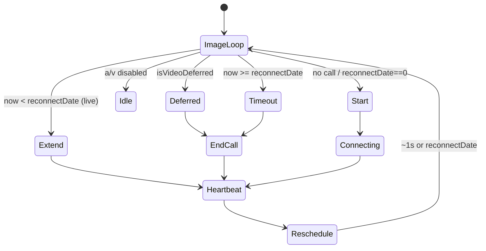
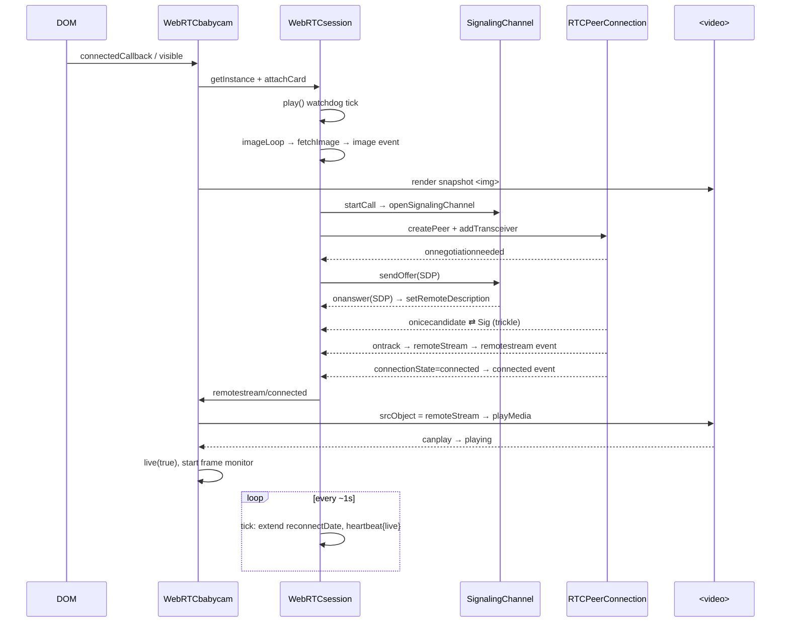

# WebRTC Babycam — Routine Event Pathways & Core Requirements

Reverse-engineered specification of [`custom_components/babycam/www/webrtc-babycam.js`](../custom_components/babycam/www/webrtc-babycam.js).

This document captures the **routine (expected) event pathways** — the recurring,
event-driven flows the code runs during normal operation and standard recovery —
and the **core requirements** each pathway must satisfy. It is written so the
behaviour could be re-implemented from this spec without re-reading the source.

> Requirements are tagged `REQ-<area>-<n>` and describe *what must happen*, not the
> exact code. Line references (`file:line`) point at the canonical implementation.

---

## 0. System architecture

The file defines three cooperating layers plus a card registration shim.

| Layer | Class | Role |
|-------|-------|------|
| **Model / controller** | `WebRTCsession` ([custom_components/babycam/www/webrtc-babycam.js:14](../custom_components/babycam/www/webrtc-babycam.js)) | Owns the WebRTC call, the snapshot image, statistics, status, and the master watchdog loop. One instance is shared by all cards that resolve to the same key. |
| **View / custom element** | `WebRTCbabycam extends HTMLElement` ([custom_components/babycam/www/webrtc-babycam.js:1396](../custom_components/babycam/www/webrtc-babycam.js)) | The `<webrtc-babycam>` Lovelace card. Renders a Shadow DOM (`<video>`, snapshot ``, PTZ, shortcuts, state icon, header, debug log) and reacts to session + media events. |
| **Signaling transport** | `SignalingChannel` and subclasses (`Go2RtcSignalingChannel`, `WhepSignalingChannel`, `RTSPtoWebSignalingChannel`) ([custom_components/babycam/www/webrtc-babycam.js:3561+](../custom_components/babycam/www/webrtc-babycam.js)) | Pluggable offer/answer/ICE transport selected by `config.url_type`. |

### 0.1 Session ↔ card relationship

```
                 WebRTCsession.sessions  (global Map, keyed per entity+a/v)
                          │
            ┌─────────────┴──────────────┐
       WebRTCsession  «1»            WebRTCsession ...
            │ state.cards  «0..*»
   ┌────────┼─────────┐
 card A    card B    card C       (multiple <webrtc-babycam> elements
 (visible) (bg)      (hidden)      can share one session / one call)
```

- **REQ-ARCH-1** — Sessions are keyed by `WebRTCsession.key(config)`: the entity id
  with non-alphanumerics replaced by `-`, plus suffix `-a` when `audio===false` and
  `-v` when `video===false` ([:94](../custom_components/babycam/www/webrtc-babycam.js)). Cards with identical
  entity **and** the same audio/video enablement **must** share one session and one
  underlying peer connection.
- **REQ-ARCH-2** — `WebRTCsession.getInstance(config)` returns the existing session
  for a key or lazily creates one and registers it ([:104](../custom_components/babycam/www/webrtc-babycam.js)).
- **REQ-ARCH-3** — The session registry must survive iframe boundaries: it is stored
  on `window.top` under `Symbol.for('webrtc-babycam:sessions')`
  ([:84](../custom_components/babycam/www/webrtc-babycam.js)).
- **REQ-ARCH-4** — The session is the single source of truth; cards never own a peer
  connection or stream. Cards observe the session through `EventTarget` custom events
  and render accordingly.

### 0.2 Session ↔ card communication (event bus)

The session owns an `EventTarget` ([:62](../custom_components/babycam/www/webrtc-babycam.js)). Each attached
card subscribes its `sessionEvent` handler to this fixed set of event types
([:604](../custom_components/babycam/www/webrtc-babycam.js), dispatched throughout; handled at
[:2031](../custom_components/babycam/www/webrtc-babycam.js)):

`status`, `remotestream`, `background`, `heartbeat`, `microphone`, `image`,
`trace`, `debug`, `stats`, `mute`, `unmuteEnabled`, `connected`.

- **REQ-ARCH-5** — Attaching a card subscribes exactly these event types; detaching
  must unsubscribe the same set ([:619](../custom_components/babycam/www/webrtc-babycam.js),
  [:653](../custom_components/babycam/www/webrtc-babycam.js)). No card-side polling of session internals.

---

## 1. Runtime state & vocabulary

### 1.1 The `call` object ([:834](../custom_components/babycam/www/webrtc-babycam.js))

Created per connection attempt and stored in `session.state.calls` (by id) with one
designated `session.state.activeCall`.

| Field | Meaning |
|-------|---------|
| `id` | `call-<salt>` unique id; `latestCallId` tracks the newest. |
| `startDate` | Creation time (used for trace timestamps). |
| `reconnectDate` | **Watchdog deadline.** `0` = expired/none; future = keep-alive until. |
| `signalingChannel` / `peerConnection` | Transport + `RTCPeerConnection`. |
| `localStream` / `remoteStream` | Mic (uplink) and received tracks. |
| `pendingCandidates` | Remote ICE candidates queued until remote description is set. |
| `closed` / `makingOffer` | Teardown + negotiation guards. |

### 1.2 Session status values (`setStatus`, [:751](../custom_components/babycam/www/webrtc-babycam.js))

`uninitialized` → `reset` → `connecting` → `connected` → `disconnected` / `error`
→ (recover) → `terminated` (final). Every transition fires a `status` event and a
trace line `STATE <value>`.

- **REQ-STATE-1** — `setStatus` must be idempotent: re-setting the current value
  emits nothing ([:752](../custom_components/babycam/www/webrtc-babycam.js)).

### 1.3 Media element `playing` attribute (the view's state machine)

The `<video>` element carries a `playing` attribute the CSS and logic key off of:
`audio` | `video` | `audiovideo` | `paused`, plus boolean attributes `stale`,
`muted`, `loaded`, `playing-started`. "Active" means playing **and not stale**:

- `isPlaying` / `isPlayingVideo` ([:2318](../custom_components/babycam/www/webrtc-babycam.js))
- `isMediaStale` ([:2330](../custom_components/babycam/www/webrtc-babycam.js))
- `isPlayingActive` = playing && !stale ([:2335](../custom_components/babycam/www/webrtc-babycam.js))

### 1.4 Timing constants ([:16–:38](../custom_components/babycam/www/webrtc-babycam.js))

| Constant | Value | Purpose |
|----------|------:|---------|
| `SIGNALING_TIMEOUT_MS` | 10000 | Deadline extension while signaling/ICE in progress. |
| `RENDERING_TIMEOUT_MS` | 10000 | Deadline extension while frames render; render-failure timeout. |
| `ICE_TIMEOUT_MS` | 10000 | Reserved constant. |
| `IMAGE_FETCH_TIMEOUT_MS` | 10000 | Snapshot HTTP fetch abort timeout. |
| `IMAGE_FETCH_INTERVAL_MS` | 3000 | Default snapshot poll interval. |
| `IMAGE_EXPIRY_MS` / `IMAGE_EXPIRY_RETRIES` | 30000 / 5 | Image staleness references. |
| `SESSION_TERMINATION_DELAY_MS` | 3000 | Grace delay before tearing down an orphaned session. |
| `VIDEO_DEFER_BASE_MS` / `VIDEO_DEFER_MAX_MS` | 2000 / 30000 | Video backoff floor/ceiling. |
| `VIDEO_FRAME_POLL_INTERVAL_MS` | 1000 | Frame-liveness poll cadence. |

Config defaults ([:2784](../custom_components/babycam/www/webrtc-babycam.js)): `image_interval=3000`,
`image_expiry=15000` (`3000×5`), `video=audio=muted=true`, `url_type="webrtc-babycam"`.

---

## 2. Pathway: Card lifecycle & viewport visibility

**Trigger:** element inserted/configured/removed; viewport or tab visibility changes.

**Flow** (`setConfig` [:2773](../custom_components/babycam/www/webrtc-babycam.js) → `connectedCallback`
[:3073](../custom_components/babycam/www/webrtc-babycam.js)):

1. `setConfig` validates WebRTC support, required `entity`, a `url` for direct
   transports (not `hass` or `webrtc-babycam`), and `ptz.service`;
   merges defaults; clamps `image_expiry`/`image_interval` to ≥33 ms. On reconfigure
   of a live card it re-runs `connectedCallback`.
2. `connectedCallback` runs one-time `globalInit()` (document gesture/keyboard
   listeners, [:1942](../custom_components/babycam/www/webrtc-babycam.js)), then `render()` (destructive Shadow
   DOM rebuild, [:3037](../custom_components/babycam/www/webrtc-babycam.js)) and
   `setupVisibilityAndResizeHandlers()` ([:2982](../custom_components/babycam/www/webrtc-babycam.js)).
3. An `IntersectionObserver` (threshold 0) and a document `visibilitychange` listener
   compute `isVisibleInViewport`; both route to `applyVisibility(visible, background)`
   ([:2843](../custom_components/babycam/www/webrtc-babycam.js)).

**Requirements**

- **REQ-LIFE-1** — A card with no config must defer all work; `connectedCallback`
  returns early until `setConfig` provides one ([:3077](../custom_components/babycam/www/webrtc-babycam.js)).
- **REQ-LIFE-2** — `setConfig` must throw on: missing `RTCPeerConnection` when
  audio/video enabled, missing `entity`, missing `url` for a direct transport,
  or `ptz` without `service`
  ([:2774](../custom_components/babycam/www/webrtc-babycam.js)).
- **REQ-LIFE-3** — Becoming visible (`applyVisibility(true)`) must: register media
  event handlers once, obtain/create the session, `attachCard`, relieve video
  pressure (force), load the remote stream if any, and refresh volume/state/mic/image
  ([:2863](../custom_components/babycam/www/webrtc-babycam.js)).
- **REQ-LIFE-4** — Becoming hidden must detach the card from the session, stop the
  frame monitor, clear controls/PTZ, and unload the media — *unless* this is the
  designated background card (see §11) ([:2895](../custom_components/babycam/www/webrtc-babycam.js)).
- **REQ-LIFE-5** — `disconnectedCallback` must remove all observers/listeners and
  apply invisibility ([:3095](../custom_components/babycam/www/webrtc-babycam.js)).
- **REQ-LIFE-6** — When a card is already running in the background and reconnects to
  the DOM, `connectedCallback` must reattach observers without a destructive re-render
  ([:3079](../custom_components/babycam/www/webrtc-babycam.js)).
- **REQ-LIFE-7** — Visibility uses both `IntersectionObserver` and a geometric
  hit-test (`isElementActuallyVisible`, corner/`elementFromPoint`,
  [:2921](../custom_components/babycam/www/webrtc-babycam.js)); when the tab is hidden the card is treated as not
  visible ([:2958](../custom_components/babycam/www/webrtc-babycam.js)).

---

## 3. Pathway: Session attach / detach / termination

**Flow:** `attachCard` ([:584](../custom_components/babycam/www/webrtc-babycam.js)) /
`detachCard` ([:632](../custom_components/babycam/www/webrtc-babycam.js)) / `terminate` ([:563](../custom_components/babycam/www/webrtc-babycam.js)).

**Requirements**

- **REQ-SESS-1** — `attachCard` must add the card to `state.cards`, subscribe the
  session event set, note interest, and start the watchdog (`play()`) if the card is
  visible or background mode is on ([:600](../custom_components/babycam/www/webrtc-babycam.js)).
- **REQ-SESS-2** — Attaching aborts any pending session termination timer
  ([:592](../custom_components/babycam/www/webrtc-babycam.js)).
- **REQ-SESS-3** — In background mode, attaching a card must release other
  non-visible background cards so only one card holds the background stream
  ([:588](../custom_components/babycam/www/webrtc-babycam.js), `releaseOtherBackgroundCards` [:2834](../custom_components/babycam/www/webrtc-babycam.js)).
- **REQ-SESS-4** — `detachCard` removes the card and its listeners; if cards remain,
  the session keeps running ([:657](../custom_components/babycam/www/webrtc-babycam.js)).
- **REQ-SESS-5** — When the last card detaches, termination must be **deferred** by
  `SESSION_TERMINATION_DELAY_MS` (3 s) and cancelled if a card reattaches within the
  grace window ([:665](../custom_components/babycam/www/webrtc-babycam.js)). This prevents teardown during quick
  DOM churn/navigation.
- **REQ-SESS-6** — `terminate()` must clear every timer, end all calls, remove the
  session from the registry, and set status `terminated` (terminal)
  ([:563](../custom_components/babycam/www/webrtc-babycam.js)).

---

## 4. Pathway: The play watchdog (master control loop)

This is the heart of the "unstoppable stream" guarantee. `play(id)`
([:450](../custom_components/babycam/www/webrtc-babycam.js)) is a single self-rescheduling timer chain.

**Flow per tick:**

1. **Re-entrancy guard:** proceed only if `id === watchdogTimeoutId` (the scheduled
   timer that fired) or `id` is undefined while no loop is pending. This guarantees a
   single live watchdog chain ([:451](../custom_components/babycam/www/webrtc-babycam.js)).
2. A fresh start (no `id`) resets status to `reset` and clears stats
   ([:466](../custom_components/babycam/www/webrtc-babycam.js)).
3. Always run `imageLoop()` (§8).
4. Decide the connection action:
   - **Video deferred** → end any active call, fall back to image loop (§10).
   - **Audio+video both disabled** → do nothing (WebRTC off).
   - **No call / expired (`reconnectDate===0`)** → `startCall()` (§5).
   - **Within deadline (`now < reconnectDate`)** → if live, extend deadline by
     `RENDERING_TIMEOUT_MS` and (if stats on) sample peer stats.
   - **Past deadline** → log "Play watchdog timeout", `endCall()` (next tick
     reconnects).
5. Update statistics (if enabled), recompute `live`, dispatch `heartbeat {live}`.
6. **Reschedule:** in `finally`, always re-arm the timer aligned to the next 1 s
   boundary or the call's `reconnectDate`, whichever is sooner
   ([:520](../custom_components/babycam/www/webrtc-babycam.js)).



**Requirements**

- **REQ-WD-1** — Exactly one watchdog timer chain runs per session at a time;
  overlapping `play()` invocations are no-ops ([:451](../custom_components/babycam/www/webrtc-babycam.js)).
- **REQ-WD-2** — The watchdog must reschedule itself in `finally` on every tick
  regardless of errors, so the loop **never dies** while cards are attached
  ([:514](../custom_components/babycam/www/webrtc-babycam.js)). The only exit is a terminated session with zero
  cards ([:515](../custom_components/babycam/www/webrtc-babycam.js)).
- **REQ-WD-3** — `reconnectDate` is the liveness deadline. While the stream renders,
  each tick pushes it forward by `RENDERING_TIMEOUT_MS`; if rendering stops for that
  long the call is torn down and re-established ([:488](../custom_components/babycam/www/webrtc-babycam.js)).
  This is the *retry-forever* mechanism.
- **REQ-WD-4** — `extendCallTimeout` only ever moves the deadline later (monotonic);
  `timeoutCall` sets it to `0` to force reconnect ([:536](../custom_components/babycam/www/webrtc-babycam.js)).
- **REQ-WD-5** — Each tick emits a `heartbeat` event carrying `live`, where `live`
  means: a call exists, `isStreaming`, and (for video) some card is actively playing
  ([:506](../custom_components/babycam/www/webrtc-babycam.js)).
- **REQ-WD-6** — `isStreaming` requires ICE state `connected|completed`, a remote
  stream, and at least one `live` track ([:787](../custom_components/babycam/www/webrtc-babycam.js)).

---

## 5. Pathway: WebRTC call establishment

**Trigger:** watchdog decides to start (§4 step 4). **Flow:** `startCall`
([:819](../custom_components/babycam/www/webrtc-babycam.js)) → `openSignalingChannel`
([:1112](../custom_components/babycam/www/webrtc-babycam.js)) → `createPeer` ([:977](../custom_components/babycam/www/webrtc-babycam.js)) →
negotiation.

1. End any existing calls; create a fresh `call`, register it, set `latestCallId`.
2. `setStatus('connecting')`, arm deadline `SIGNALING_TIMEOUT_MS`.
3. If `microphone` and secure context, `getUserMedia({audio})` for uplink
   (failure is non-fatal) ([:853](../custom_components/babycam/www/webrtc-babycam.js)).
4. Open the signaling channel for `url_type` (§7). Failure throws → status `error`.
5. `createPeer`: build `RTCPeerConnection` (STUN `stun.l.google.com:19302`) and wire
   handlers ([:988](../custom_components/babycam/www/webrtc-babycam.js)).
6. Add transceivers/tracks per config:
   - `video:true` → `addTransceiver('video', recvonly)`.
   - mic track present → `addTrack`; if `audio:false`, force that audio transceiver
     `sendonly` (talk-back only), else two-way.
   - else `audio:true` → `addTransceiver('audio', recvonly)`.
7. Adding media triggers `onnegotiationneeded` → create offer (`iceRestart:true`) →
   `setLocalDescription` → `signalingChannel.sendOffer` ([:991](../custom_components/babycam/www/webrtc-babycam.js)).
8. Answer arrives → `setRemoteDescription` → flush queued ICE candidates
   ([:1218](../custom_components/babycam/www/webrtc-babycam.js)).
9. ICE candidates exchanged both directions; local candidates sent as gathered,
   remote candidates added (or queued until remote description exists)
   ([:1055](../custom_components/babycam/www/webrtc-babycam.js), [:1181](../custom_components/babycam/www/webrtc-babycam.js)).
10. `ontrack` builds `remoteStream`, dispatches `remotestream`
    ([:1072](../custom_components/babycam/www/webrtc-babycam.js)).
11. `onconnectionstatechange === 'connected'` → status `connected`, dispatch
    `connected`, extend deadline `RENDERING_TIMEOUT_MS` ([:1042](../custom_components/babycam/www/webrtc-babycam.js)).

**Requirements**

- **REQ-CALL-1** — Starting a call must first end every existing call for the session
  (one active connection at a time) ([:827](../custom_components/babycam/www/webrtc-babycam.js)).
- **REQ-CALL-2** — Transceiver/track direction must match config: video recvonly;
  audio recvonly, sendonly (mic-only with `audio:false`), or two-way
  ([:876](../custom_components/babycam/www/webrtc-babycam.js)).
- **REQ-CALL-3** — Microphone acquisition is best-effort and must never abort the call
  ([:860](../custom_components/babycam/www/webrtc-babycam.js)).
- **REQ-CALL-4** — Remote ICE candidates received before the remote description must
  be queued and flushed once it is set ([:1181](../custom_components/babycam/www/webrtc-babycam.js)).
- **REQ-CALL-5** — **Stale-event guard:** every peer/signaling callback must ignore
  events from a call that is closed, not `latestCallId`, or no longer registered
  (`isStale()`) ([:986](../custom_components/babycam/www/webrtc-babycam.js), [:1202](../custom_components/babycam/www/webrtc-babycam.js)).
  This prevents a torn-down call's late callbacks from corrupting the active one.
- **REQ-CALL-6** — Offer creation requests an ICE restart and disables VAD; offer
  send and ICE send each extend the signaling deadline ([:1004](../custom_components/babycam/www/webrtc-babycam.js)).
- **REQ-CALL-7** — `ontrack` must filter tracks against config (drop audio when
  `audio:false`, video when `video:false`), dedupe by track id, and remove tracks on
  `ended`, nulling the stream when empty ([:1082](../custom_components/babycam/www/webrtc-babycam.js)).
- **REQ-CALL-8** — On `connected`, the deadline must be extended so the new connection
  has a full render window before the watchdog can time it out
  ([:1045](../custom_components/babycam/www/webrtc-babycam.js)).

---

## 6. Pathway: Remote stream rendering & media events

**Trigger:** session `remotestream`/`connected` events → card renders into `<video>`.

**Flow:**

1. `sessionEvent('remotestream'|'connected')` → `loadRemoteStream()` /
   `unloadRemoteStream()` ([:2038](../custom_components/babycam/www/webrtc-babycam.js), [:2085](../custom_components/babycam/www/webrtc-babycam.js)).
2. `loadRemoteStream` sets `media.srcObject` (bumping `playGen`), marks `loaded`, and
   calls `playMedia()` if streaming and not already active ([:3101](../custom_components/babycam/www/webrtc-babycam.js)).
3. Media element events drive the view state machine (`mediaEvent`,
   [:3363](../custom_components/babycam/www/webrtc-babycam.js)):
   - `canplay` → `noteMediaActivity` + `playMedia` (autoplay).
   - `play` → arm a `RENDERING_TIMEOUT_MS` render watchdog.
   - `playing` → set `playing=audio|video|audiovideo`, record aspect ratio, show
     `live`, refresh state/volume, start the frame monitor.
   - `timeupdate` → `noteMediaActivity` (keeps audio-only liveness fresh).
   - `volumechange` → sync `muted` attribute, refresh volume.

**Requirements**

- **REQ-MEDIA-1** — Loading the *same* `srcObject` again must be a no-op; a new stream
  bumps `playGen` so stale `play()` promise resolutions are ignored
  ([:3106](../custom_components/babycam/www/webrtc-babycam.js), [:3299](../custom_components/babycam/www/webrtc-babycam.js)).
- **REQ-MEDIA-2** — The `playing` attribute must reflect actual track composition
  read from `srcObject` at `playing` time (audio-only vs video vs audiovideo)
  ([:3441](../custom_components/babycam/www/webrtc-babycam.js)).
- **REQ-MEDIA-3** — On `play`, if frames do not render within `RENDERING_TIMEOUT_MS`
  and no card is playing, the card must unload, defer video, and restart the call
  ([:3418](../custom_components/babycam/www/webrtc-babycam.js)). This catches "connected but black" streams.
- **REQ-MEDIA-4** — `unloadRemoteStream` must clear all media attributes, stop the
  frame monitor, clear timers, and null `srcObject` ([:3123](../custom_components/babycam/www/webrtc-babycam.js)).
- **REQ-MEDIA-5** — The created media element is always a muted, autoplay,
  playsinline `<video>` with native controls off ([:3342](../custom_components/babycam/www/webrtc-babycam.js)).

---

## 7. Pathway: Signaling transport contract

`openSignalingChannel` ([:1112](../custom_components/babycam/www/webrtc-babycam.js)) selects an implementation by
`config.url_type` and wires `oncandidate`/`onanswer`/`onerror`/`ontrace`, then
`open(SIGNALING_TIMEOUT_MS)`.

| `url_type` | Class | Transport |
|------------|-------|-----------|
| `hass` | `HomeAssistantSignalingChannel` | HA's authenticated `camera/webrtc` websocket API |
| `go2rtc` | `Go2RtcSignalingChannel` | WebSocket `…/api/ws?src=…` ([:1120](../custom_components/babycam/www/webrtc-babycam.js)) |
| `webrtc-babycam` | `Go2RtcSignalingChannel` | HA-signed `/api/babycam/ws` integration proxy ([:1130](../custom_components/babycam/www/webrtc-babycam.js)) |
| `webrtc-camera` | `Go2RtcSignalingChannel` | HA-signed `/api/webrtc/ws` ([:1146](../custom_components/babycam/www/webrtc-babycam.js)) |
| `whep` | `WhepSignalingChannel` | HTTP POST offer / PATCH trickle-ICE ([:1160](../custom_components/babycam/www/webrtc-babycam.js)) |
| `rtsptoweb` | `RTSPtoWebSignalingChannel` | HTTP POST form ([:1168](../custom_components/babycam/www/webrtc-babycam.js)) |

**Requirements**

- **REQ-SIG-1** — All channels implement the `SignalingChannel` contract:
  `open/close/sendOffer/sendCandidate`, `isOpen`, and the four callbacks
  ([:3561](../custom_components/babycam/www/webrtc-babycam.js)).
- **REQ-SIG-2** — `webrtc-babycam`/`webrtc-camera` must obtain a signed path via
  `hass.callWS({type:'auth/sign_path'})` before opening the socket
  ([:1137](../custom_components/babycam/www/webrtc-babycam.js)).
- **REQ-SIG-3** — `Go2RtcSignalingChannel.open` must time out after the given ms,
  closing the socket and rejecting if not open ([:3781](../custom_components/babycam/www/webrtc-babycam.js)).
- **REQ-SIG-4** — go2rtc messages map: `webrtc/offer`→send, `webrtc/answer`→`onanswer`,
  `webrtc/candidate`→`oncandidate` (empty value = end-of-candidates), `error`→`onerror`
  + close ([:3857](../custom_components/babycam/www/webrtc-babycam.js)).
- **REQ-SIG-5** — WHEP must POST SDP (expect `201`, capture `E-Tag`) and PATCH ICE
  fragments with `If-Match` (expect `204`), building the SDP fragment from parsed
  offer ufrag/pwd/media lines ([:3701](../custom_components/babycam/www/webrtc-babycam.js), [:3677](../custom_components/babycam/www/webrtc-babycam.js)).
- **REQ-SIG-6** — All HTTP signaling must enforce `timeout` via `AbortController` and
  surface timeouts through `onerror` ([:3705](../custom_components/babycam/www/webrtc-babycam.js), [:3989](../custom_components/babycam/www/webrtc-babycam.js)).
- **REQ-SIG-7** — If no channel can be built the session sets `error` and aborts the
  call ([:1174](../custom_components/babycam/www/webrtc-babycam.js)).

---

## 8. Pathway: Image snapshot fallback loop

**Trigger:** runs continuously via the watchdog; provides a recent still whenever
video is not actively playing. `imageLoop` ([:428](../custom_components/babycam/www/webrtc-babycam.js)) +
`fetchImage` ([:1267](../custom_components/babycam/www/webrtc-babycam.js)).

**Flow:**

1. `imageLoop` self-schedules at the smallest `image_interval` across attached cards,
   **phase-aligned** by a hash of the session key so multiple cameras stagger their
   fetches ([:396](../custom_components/babycam/www/webrtc-babycam.js), [:415](../custom_components/babycam/www/webrtc-babycam.js)).
2. Each tick fetches an image **only if no card is currently playing video**
   ([:446](../custom_components/babycam/www/webrtc-babycam.js)).
3. `fetchImage` resolves the URL (HA `entity_picture`, else `config.image_url`),
   fetches with `cache:no-store` under `IMAGE_FETCH_TIMEOUT_MS`, then `setImage(blob)`
   which dispatches `image` ([:1289](../custom_components/babycam/www/webrtc-babycam.js)).
4. Card `sessionEvent('image')` → `refreshImage` swaps the `` src and (re)starts
   the "blur after duration" animation; expired images render pre-blurred
   ([:2589](../custom_components/babycam/www/webrtc-babycam.js)).

**Requirements**

- **REQ-IMG-1** — Only one image fetch may be in flight at a time
  (`fetchImageTimeoutId` guard) ([:1268](../custom_components/babycam/www/webrtc-babycam.js)).
- **REQ-IMG-2** — Cached images younger than `maximumCacheAge` (default 300 ms) are
  not re-fetched; `fetchImage(0)` forces a fetch ([:1269](../custom_components/babycam/www/webrtc-babycam.js)).
- **REQ-IMG-3** — The image loop must not fetch while video is actively rendering, to
  avoid redundant bandwidth ([:446](../custom_components/babycam/www/webrtc-babycam.js)).
- **REQ-IMG-4** — A snapshot must be refreshed at teardown: `endCall` attempts one
  `fetchImage` before closing transports ([:921](../custom_components/babycam/www/webrtc-babycam.js)).
- **REQ-IMG-5** — Displayed images visibly age: a CSS animation blurs/fades the still
  after `image_expiry`, and images already past expiry render blurred immediately
  ([:1590](../custom_components/babycam/www/webrtc-babycam.js), [:2604](../custom_components/babycam/www/webrtc-babycam.js)). This signals
  stale data to the viewer.
- **REQ-IMG-6** — Object URLs created for `` must be revoked on replacement and
  after `image_expiry` to avoid leaks ([:2600](../custom_components/babycam/www/webrtc-babycam.js), [:2629](../custom_components/babycam/www/webrtc-babycam.js)).

---

## 9. Pathway: Liveness, staleness & frame monitoring

**Goal:** detect a frozen-but-"playing" stream and prove liveness to the viewer.

**Flow** ([:2362–:2467](../custom_components/babycam/www/webrtc-babycam.js)):

1. `scheduleVideoFrameMonitor` registers `requestVideoFrameCallback`; each delivered
   frame calls `noteMediaActivity` and re-arms.
2. `noteMediaActivity` records `lastMediaActivityDate`, clears `stale`, schedules the
   next stale check, and relieves video pressure on a real video frame.
3. `scheduleMediaStaleCheck` marks media `stale` if no activity occurred within
   `image_expiry`.
4. `setMediaStale(true)` blurs the video, drops `live`, and (for video) defers video +
   triggers an image fetch.

**Requirements**

- **REQ-LIVE-1** — Video liveness is tracked frame-accurately via
  `requestVideoFrameCallback`; audio-only liveness via `timeupdate`
  ([:2394](../custom_components/babycam/www/webrtc-babycam.js), [:3473](../custom_components/babycam/www/webrtc-babycam.js)).
- **REQ-LIVE-2** — If no frame/activity arrives within `image_expiry`, the media must
  be marked `stale` (visually blurred, `live` off) ([:2405](../custom_components/babycam/www/webrtc-babycam.js)).
- **REQ-LIVE-3** — Going stale on a video card must defer video and fetch a fresh
  snapshot so the viewer keeps seeing a recent image ([:2432](../custom_components/babycam/www/webrtc-babycam.js)).
- **REQ-LIVE-4** — A real video frame must relieve video pressure (reset backoff)
  ([:2453](../custom_components/babycam/www/webrtc-babycam.js), [:2454](../custom_components/babycam/www/webrtc-babycam.js)).
- **REQ-LIVE-5** — The `live` indicator (blinking dot) is re-triggered each
  `heartbeat` while live, giving ~1 Hz positive confirmation of playback
  ([:2052](../custom_components/babycam/www/webrtc-babycam.js), `live()` [:3137](../custom_components/babycam/www/webrtc-babycam.js)).

---

## 10. Pathway: Audio autoplay & unmute policy

Browsers block unmuted autoplay without a user gesture; this pathway maximises
unmuted playback while always degrading to muted rather than failing.

**Flow:**

1. At construction, probe `canPlayUnmutedAudio()` (silent MP3) to seed
   `WebRTCsession.unmuteEnabled` ([:116](../custom_components/babycam/www/webrtc-babycam.js), [:125](../custom_components/babycam/www/webrtc-babycam.js)).
2. The first document `keydown`/`mousedown`/`touchstart` calls `enableUnmute()`,
   broadcasting `unmuteEnabled` ([:1966](../custom_components/babycam/www/webrtc-babycam.js)).
3. `playMedia` ([:3259](../custom_components/babycam/www/webrtc-babycam.js)) decides mute state; if unmute isn't
   enabled it plays muted and flags `unmute-pending`. On `NotAllowedError` it retries
   muted and records `enableUnmute(false)`.
4. On `unmuteEnabled` event, any card with `unmute-pending` unmutes
   ([:2078](../custom_components/babycam/www/webrtc-babycam.js)).

**Requirements**

- **REQ-AUDIO-1** — Playback must never hard-fail on autoplay restrictions: an
  unmuted-play rejection must fall back to muted play ([:3318](../custom_components/babycam/www/webrtc-babycam.js)).
- **REQ-AUDIO-2** — Desired-but-blocked unmuting is remembered via `unmute-pending`
  and applied automatically once a gesture enables it ([:3284](../custom_components/babycam/www/webrtc-babycam.js),
  [:2079](../custom_components/babycam/www/webrtc-babycam.js)).
- **REQ-AUDIO-3** — A successful unmuted play sets the global `unmuteEnabled` true so
  other cards can unmute ([:3307](../custom_components/babycam/www/webrtc-babycam.js)).
- **REQ-AUDIO-4** — `unmuteEnabled` is a global (cross-session) capability flag,
  broadcast to every session on change ([:680](../custom_components/babycam/www/webrtc-babycam.js)).

---

## 11. Pathway: Pause / stop reversal (never-stop guarantee)

**Trigger:** the media element emits `pause` (user tap, OS, or stream hiccup).

**Flow** (`mediaEvent('pause')`, [:3378](../custom_components/babycam/www/webrtc-babycam.js)):
mark `playing=paused`; if the pause was intentional (`pause-pending`) or a play retry
is mid-flight, leave it; otherwise, unless `allow_pause` + controls are active,
schedule `playMedia()` to resume.

**Requirements**

- **REQ-PAUSE-1** — For continuous monitoring, an unintended pause must auto-resume
  ([:3400](../custom_components/babycam/www/webrtc-babycam.js)).
- **REQ-PAUSE-2** — Pausing is only honoured when `allow_pause` is set *and* controls
  are showing ([:3398](../custom_components/babycam/www/webrtc-babycam.js)).
- **REQ-PAUSE-3** — Programmatic pauses set `pause-pending` so the auto-resume logic
  can distinguish them ([:3253](../custom_components/babycam/www/webrtc-babycam.js)).

---

## 12. Pathway: Connection failure & reconnection

**Triggers:** `connectionState` `disconnected|failed|closed`; signaling/negotiation
errors; renegotiation on a closed channel; media `error`/`stalled`/`waiting`.

**Flow:**

- `onconnectionstatechange` failure → `restartCall` ([:1047](../custom_components/babycam/www/webrtc-babycam.js)).
- `restartCall` ([:546](../custom_components/babycam/www/webrtc-babycam.js)) ends the call, clears the watchdog,
  forces `reconnectDate=0`, and calls `play()` → next tick starts a fresh call.
- Media `waiting`/`stalled`/`error` mark the media stale and (for video) defer video;
  in background-audio mode they instead restart the call to keep audio alive
  ([:3477](../custom_components/babycam/www/webrtc-babycam.js), [:3486](../custom_components/babycam/www/webrtc-babycam.js), [:3524](../custom_components/babycam/www/webrtc-babycam.js)).

**Requirements**

- **REQ-RECON-1** — Any terminal/failed peer connection state must trigger a full
  call restart ([:1047](../custom_components/babycam/www/webrtc-babycam.js)).
- **REQ-RECON-2** — Reconnection is unbounded: the watchdog re-establishes calls
  forever while cards are attached (no max-retry) (§4 REQ-WD-2/3).
- **REQ-RECON-3** — `endCall` must fully release resources: close signaling + peer,
  stop all local/remote tracks, null streams, drop the call from the registry, and
  emit `remotestream:null` + `connected:false` ([:914](../custom_components/babycam/www/webrtc-babycam.js)).
- **REQ-RECON-4** — Renegotiation requested while the signaling channel is unavailable
  must restart the call rather than fail silently ([:996](../custom_components/babycam/www/webrtc-babycam.js)).

---

## 13. Pathway: Background audio mode

Lets audio keep streaming when the card is offscreen / the app is backgrounded
(e.g. iPhone screen off).

**State:** `session.background` is persisted in `localStorage`
(`webrtc.<key>.background`) ([:762](../custom_components/babycam/www/webrtc-babycam.js)).

**Key predicate:** `shouldKeepBackgroundAudio` = background on, audio enabled, and no
*visible* video card ([:340](../custom_components/babycam/www/webrtc-babycam.js)).

**Requirements**

- **REQ-BG-1** — When `shouldKeepBackgroundAudio` holds, video deferral is ignored and
  media `waiting/stalled/error` keeps audio alive (restart instead of going stale)
  ([:369](../custom_components/babycam/www/webrtc-babycam.js), [:3479](../custom_components/babycam/www/webrtc-babycam.js)).
- **REQ-BG-2** — A hidden card stays attached only if it is the designated background
  card; all other hidden background cards are released so a single card holds the
  stream ([:2895](../custom_components/babycam/www/webrtc-babycam.js), [:2834](../custom_components/babycam/www/webrtc-babycam.js)).
- **REQ-BG-3** — Background state changes persist across reloads and broadcast a
  `background` event ([:766](../custom_components/babycam/www/webrtc-babycam.js)).
- **REQ-BG-4** — Background mode is reachable only when allowed
  (`config.background` or `config.allow_background`); the volume control cycles
  mute → background → mute accordingly ([:3219](../custom_components/babycam/www/webrtc-babycam.js)).

---

## 14. Pathway: Video deferral / backoff pressure

Prevents hammering a flaky video source: repeated video failures back off
exponentially while the image loop keeps the picture fresh.

**Flow** (`deferVideo` [:367](../custom_components/babycam/www/webrtc-babycam.js),
`relieveVideoPressure` [:356](../custom_components/babycam/www/webrtc-babycam.js)):
each defer raises `videoPressure` (cap 5) and sets `videoDeferredUntil` =
`now + min(VIDEO_DEFER_MAX_MS, BASE × 2^(pressure-1))` (2 s → 30 s). While deferred,
the watchdog ends the call and runs image-only. A successful frame relieves pressure;
becoming visible force-clears it.

**Requirements**

- **REQ-DEFER-1** — Video deferral uses capped exponential backoff
  (2 s base, 30 s ceiling) keyed to consecutive failures
  ([:374](../custom_components/babycam/www/webrtc-babycam.js)).
- **REQ-DEFER-2** — While `isVideoDeferred`, the active call is ended and the session
  serves the image loop only ([:474](../custom_components/babycam/www/webrtc-babycam.js), [:344](../custom_components/babycam/www/webrtc-babycam.js)).
- **REQ-DEFER-3** — Deferral must never apply when it would break background audio
  ([:369](../custom_components/babycam/www/webrtc-babycam.js)).
- **REQ-DEFER-4** — A successful video frame relieves one pressure step; a card
  becoming visible force-resets deferral ([:2454](../custom_components/babycam/www/webrtc-babycam.js),
  [:2879](../custom_components/babycam/www/webrtc-babycam.js)).

---

## 15. Pathway: User interaction

`buttonClick` ([:2217](../custom_components/babycam/www/webrtc-babycam.js)) dispatches all on-card controls;
hold/tap/double-tap helpers ([:2102–:2215](../custom_components/babycam/www/webrtc-babycam.js)) add gestures.

**Requirements**

- **REQ-UI-1** — Volume icon cycles state per §13 REQ-BG-4 (`toggleVolume`
  [:3219](../custom_components/babycam/www/webrtc-babycam.js)).
- **REQ-UI-2** — Microphone toggle flips `session.microphone`, which restarts the call
  when streaming (renegotiate with/without uplink) ([:2231](../custom_components/babycam/www/webrtc-babycam.js),
  [:776](../custom_components/babycam/www/webrtc-babycam.js)).
- **REQ-UI-3** — PTZ buttons call `config.ptz.service` with the matching
  `data_<direction>` payload and refresh the snapshot ~2 s later
  ([:2258](../custom_components/babycam/www/webrtc-babycam.js)).
- **REQ-UI-4** — Shortcut buttons call their configured HA `service` with
  `service_data` ([:2245](../custom_components/babycam/www/webrtc-babycam.js)).
- **REQ-UI-5** — Tapping the snapshot forces an immediate image fetch and notes
  interest; press-and-hold repeats it ([:1998](../custom_components/babycam/www/webrtc-babycam.js)).
- **REQ-UI-6** — Double-tap / double-click toggles fullscreen (when enabled); with
  `fullscreen:"video"` it enables video on entry and disables on exit, restarting the
  call ([:2749](../custom_components/babycam/www/webrtc-babycam.js)).
- **REQ-UI-7** — The state icon reflects status: heart-broken (no status), loading
  spinner (connecting), volume-mute (audio-only waiting), error, pause, pin
  (background), mute/unmute mismatch, dead emoji (terminated)
  (`refreshState` [:2469](../custom_components/babycam/www/webrtc-babycam.js)).

---

## 16. Pathway: Statistics

When stats are enabled (`config.stats` or global), each watchdog tick samples
`RTCPeerConnection.getStats` and computes a header.

**Requirements**

- **REQ-STATS-1** — Stats sampling occurs only when enabled, on the watchdog tick
  ([:492](../custom_components/babycam/www/webrtc-babycam.js), [:332](../custom_components/babycam/www/webrtc-babycam.js)).
- **REQ-STATS-2** — `updateStatistics` derives received bytes/s, fps, and a "render
  quality" % from a rolling history; a frame-count reset re-bases the history
  ([:241](../custom_components/babycam/www/webrtc-babycam.js)). Render quality compares decoded vs expected
  frames (configured/estimated fps).
- **REQ-STATS-3** — The computed header is published to `state.statistics` and shown
  in the card header when stats are visible ([:2480](../custom_components/babycam/www/webrtc-babycam.js)).

---

## 17. Global controls & keyboard shortcuts

`globalInit` ([:1942](../custom_components/babycam/www/webrtc-babycam.js)) installs document listeners once.

**Requirements**

- **REQ-GLOBAL-1** — Keyboard toggles (with Shift): `T` global mute, `D` global debug,
  `S` global stats; each broadcasts the corresponding event to every session
  ([:1946](../custom_components/babycam/www/webrtc-babycam.js), [:692](../custom_components/babycam/www/webrtc-babycam.js)).
- **REQ-GLOBAL-2** — `?debug`/`?stats` URL params seed the global debug/stats flags
  ([:20](../custom_components/babycam/www/webrtc-babycam.js)).
- **REQ-GLOBAL-3** — Debug mode reveals a translucent in-card log that mirrors session
  traces; tracing auto-enables when debug is shown ([:1458](../custom_components/babycam/www/webrtc-babycam.js),
  [:2730](../custom_components/babycam/www/webrtc-babycam.js)).
- **REQ-GLOBAL-4** — The element registers as `<webrtc-babycam>` and pushes a Lovelace
  card descriptor onto `window.customCards` ([:3547](../custom_components/babycam/www/webrtc-babycam.js)).

---

## Appendix A — End-to-end "happy path" sequence



## Appendix B — Core invariants (cross-cutting)

1. **Single watchdog, single active call per session** (REQ-WD-1, REQ-CALL-1).
2. **Loop never dies while cards are attached** (REQ-WD-2).
3. **Always show a recent picture** — snapshot before/around every WebRTC gap
   (REQ-IMG-3/4/5).
4. **Degrade, never fail** — unmuted→muted audio (REQ-AUDIO-1), video→image deferral
   (REQ-DEFER-2), pause→resume (REQ-PAUSE-1).
5. **Stale-event safety** — late callbacks from torn-down calls are ignored
   (REQ-CALL-5).
6. **Liveness is proven, not assumed** — frame-accurate staleness + blinking live dot
   (REQ-LIVE-1/2/5).
```
